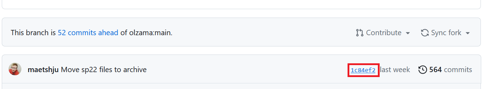

## Assignment 1: Preliminaries

In this assignment, you will:

* Download the data you will be working with in all (or most) of the assignments.
* Start thinking about language data in data science and machine learning terms.
* Create and start using a personal repository on GitHub where you will store your code for the class.
* Start learning how to program in python using the PyCharm IDE.
* Learn how to connect to a remote server and run python and git there.

Submission summary:
* Part 1: A text file answering questions about the IMDB review dataset.
* Part 2: Private GitHub repository created; Matt and Siyu added as collaborators.
* Part 3: 
   * A file **called your-UW-NetID-assignment1.py** in your repository
   * A question/comment in the Discussion area for Assignment 1 related to how things are organized in PyCharm (note: a question about installation won't count here!)
   * A question/comment in the Discussion area for Assignment 1 related to Source Control and how to stage, commit, push, and pull changes using, e.g., PyCharm. (You can use command line if you know how to do it, or some other tool).
* Part 4: Nothing
* Part 5: A screenshot of your program output from the command line, and a document containing the link to the GitHub repository commit.

### NB: This assignment may seem very long. 
The purpose is to give you enough time to become accustomed to a range of tools which are unavoidable in most computational work. Go through it gradually, one part at a time (and split those between multiple days if needed). Post any questions to the Discussion Board on Canvas! Consult the [Asking Questions on the Discussion Board Guidelines](https://github.com/maetshju/Ling471/blob/main/questions.md)

### Part 1: The IMDB review dataset

We will be using the IMDB review dataset ([Maas et al. 2011](https://www.aclweb.org/anthology/P11-1015.pdf))
1. Download the dataset from [here](https://ai.stanford.edu/~amaas/data/sentiment/). 
1. On **Linux/Mac**: Unpack the dataset by double-clicking on it or by using a utility appropriate for your OS. For **Windows**, download it from Canvas-->Files, but still follow the [link](https://ai.stanford.edu/~amaas/data/sentiment/) and read what's there. The dataset is an **archived folder** of the TAR.GZ type; you need special software to extract the contents. Windows does not have that software by default, but it can do .zip, so I created a ZIP version for you and uploaded it to Canvas.
1. Unpack the dataset by double-clicking on it or by using a utility appropriate for your OS.
1. Read the README file which comes with the dataset.
1. In a text file, answer the following questions about the dataset:
   1. How many movie reviews does it contain?
   1. How is the dataset divided? (Here, talk about how many reivews are in each folder and what each folder represents, in your own words. Do not copy the text from the README file.)
   1. **Why** is it divided in this way? (Make sure to give a thoughtful answer here, at least a paragraph! You may not yet know everything about this, but answer the best you can, based on what you learned in the first couple weeks of class.) (**NB: Complete closer to the due date!**)
   1. Why is a citation to the ACL paper by Maas et al. included in the README file and in the dataset description on the website? (**What is the relationship of the paper and of the dataset?** Thoughtful, paragraph-length answer here.)
   1.  Why is there a reference to Potts's paper?
   1. Would you say this README file qualifies as a "data statement" (see Bender and Friedman, 2019, which was assigned earlier). If yes, point to the specific portions of the file and map them to corresponding definitions from Bender and Friedman's paper. If no, explain what a data statement could look like for such a dataset or why the concept does not apply here. You can of course argue against data statements here if you like! It is up to you; what counts is the depth and quality of argument. 
1. Submit your text file **to Canvas**, in the appropriate area associated with Assignment 1.

### Part 2: Git and Your GitHub repository (NB: Complete what you can now and the rest after April 6.)
In this part of the assignment, you will create a GitHub repository for your code in this class.
1. Create an account on https://github.com/
1. Create a new repository; make it private. Call it whatever you like, but you will use it for this class. The screenshot below shows what creating a repository looks like on GutHub:

    

1. After you've created the repository, note its https:// address:

    

1. Go to Settings and add `maetshju` and `siyuliang` as "collaborators" (**NB:** this counts as your **submission** for this task):

    

1. Now, install git on your machine. Click on the "Latest Source Release 2.35.1." button [here](https://git-scm.com/downloads) 
1. Ask a question about git or leave a comment about it in the Assignment 1 discussion board area on Canvas. It can be anything. 

### Part 3: Python and PyCharm. (NB: Complete what you can now. You should be able to do everything after April 6.)
In this part of the assignment, you will start learning how to program in python and how to use an Integrated Development Environment. You should already have Python and PyCharm installed from lecture. You should also already know that it is working.

1. Set up Git and GitHub in PyCharm using [the steps on this page](https://www.jetbrains.com/help/pycharm/github.html#register-account).

1. Now, clone the repository you've created in Part 2 into PyCharm. Use the instructions on [this page of the PyCharm documentation](https://www.jetbrains.com/help/pycharm/set-up-a-git-repository.html#clone-repo) (go to the "Check out a project from a remote host (clone)" section).

1. Add a python file to your PyCharm project. Make sure the folder from Git is selected, and then click "File > New > Python file". **It is crucial that the file name has your UW netID in it!!!**.

1. You will be asked if you want to add this file to Git. Say, "Add." Your PyCharm project should look similar to this:

    .

1. Write a program in python which prints a statement, such as "Hello, world!" (or whatever you like).

1. In the menu, click "Git > Commit". You will see a message like this:

    

1. Enter a meaningfull commit message. Then click on the "Commit" button.

1. In the menu, click on "Git > Push". In the dialog box that appears, click on the "Push" button. This will push your new Python file into your GitHub repository.

1. Give it a few minutes, and check that your python file can be found not only in the local copy but also in the remote repository. (NB: This will count as your **submission** for this task.) **Check once more that the file name has your UW netID in it!!! If not, rename it so it does!**
 
     

1. Write YOUR FULL NAME in your README file using the GitHub website. Click on the README file, click on edit, write something, then click on "Commit changes". If you do not have a README file in your repository, click on the "Add file" button in GitHub and then "Create new file." Title the file README and then fill in as specified before.

    
    

1. Now go to PyCharm, and in the menu, click "Git > Pull" and then click "Pull" in the box that appears. Make sure that you now see the updated README!

1. Leave a question or comment about PyCharm in the Assignment 1 discussion area on Canvas, if you haven't already.

### Part 4: Generating a personal access token.

Somewhat recently, GitHub removed the option to log into GitHub with a username and password over a command line. Instead, you have to either use a personal access token or set up SSH keys. Instructions here will be for generating a personal access token, but if you have already set up SSH keys, you do not need to do this. The official guide with pictures [is located here](https://docs.github.com/en/authentication/keeping-your-account-and-data-secure/creating-a-personal-access-token).

1. Go to GitHub and log in if needed. Click on your profile image in the upper right. Click on "Settings."

1. In the page that loads, click on "< > Developer settings" at the bottom of the left-hand side. Then, click on "Personal access tokens."

1. In the next page, click on "Generate new token." Put an informative name into the "Note" field.

1. Choose how long you want the token to last for. Note that if it expires, you will need to make a new one.

1. Check the "repo" box.

1. Click "Generate token" at the bottom.

1. On the next page, you will be shown what the token is. It starts with "ghp_". Save it somewhere **RIGHT NOW**. You will not be able to see it in plain text ever again once you leave this page. It helps if you click on the two overlapping square icon next to the token, which will copy it to your clipboard. Save this token somewhere safe because you will be using it like a password on the command line.

1. If you did not get your token written down, that's okay. Just make a new one!

### Part 5: Command line and remote servers. (**NB: Complete after April 7**)

It is important to be able to use a command line when programming. This may be performed on your local computer, or on a remote server like Patas. You will not always have access to a graphical interface like PyCharm or the GitHub website, and text-based interfaces are sometimes more convenient than graphical ones.

For the following instructions, you may perform them either on your own computer or using Patas. This quarter, Patas has been somewhat unreliable, so I would recommend trying to use your own computer first.

#### Part 5 option A: Using your own computer

If you are using a Mac or Linux, you should be able to use the built in command lines. If you are on Windows 10/11, you will likely want to [install the Windows Subsystem for Linux](https://learn.microsoft.com/en-us/windows/wsl/install) to use the Linux-based command line (Windows 8 and earlier cannot do this). However, I will provide instructions for using the Windows PowerShell and CMD command lines as well.

1. Open your command line utility (e.g., `Terminal`, `CMD`, `PowerShell`, `Konsole`, etc.). Use the `cd` command to navigate to a folder where you would like to download a copy of your Git repository on GitHub. (The `cd` command is the same across all the types of command lines we will be using.)

2. [If you have not yet installed Git, please do so now.](https://git-scm.com/book/en/v2/Getting-Started-Installing-Git) On Windows, the Git for Windows option is often easiest. Then, type the command `git clone your-repo-address` and press enter/return.

	It will ask you for your GitHub username and password. Your password is the token you generated in Part 4. There may be some error messages; ignore them. Just make sure you type your password correctly, or better yet, copy and paste it from where you stored it.
	
3. Enter your repository folder using `cd`. Execute the Python program and observe it printing whatever it prints.

4. Take a screenshot of the output and add this to your submission on Canvas. Please note that we will be running your script during grading, and the output should match what is shown in your screenshot.

#### Part 5 option B: Using Patas

1. Open a terminal on your Linux/Mac or Windows 10/11 (if you have an earlier version of Windows, you will need additional instructions, so contact Matt and Siyu ahead of time).
1. Connect to the patas cluster (where you should have created an account last week!):

    `ssh your-NetID@patas.ling.washington.edu`
 
     (It will ask you whether you should add patas to trusted hosts; type yes.)
	 
1. Check that you have proper access to patas. You should see something like: `your-user-name@patas:~$` or simply `bash-4.2$`. If you don't yet have access, let Matt know. Sometimes there are delays in how the accounts are created and set up. If you see `bash-4.2$` or similar but would like to see your username and current directory instead, try typing the following in the terminal: `echo "PS1='\u@patas:\w\$ '" >> ~/.bash_profile; source ~/.bash_profile` -- and pressing `Enter`. That will change what you see in the prompt.

1. Clone your git repository into your home directory on patas:

    `git clone your-repo-address`

    It will ask you for your GitHub username and password. Your password is the token you generated in Part 4. There may be some error messages; ignore them. Just make sure you type your password correctly, or better yet, copy and paste it from where you stored it.

1. Navigate into your repository folder on patas with `cd`. Execute the python program and observe it printing whatever it prints.

1. Take a screenshot of the output and add this to your submission on Canvas. Please note that we will be running your script during grading, and the output should match what is shown in your screenshot.

#### Part 5 deliverables

1. Take a screenshot of the output and add this to your submission on Canvas. Please note that we will be running your script during grading, and the output should match what is shown in your screenshot.

2. Go to your GitHub respository and locate the link to the commit number toward the top of your repo. (See below image.)

3. Click on the link, and then copy the URL of the page it takes you to. Add this link to a text file/document (e.g., .txt, .docx, .odt, etc.) and add this file to your Canvas submission.

You are now **DONE** with Assignment 1! **Don't forget to submit the file for Part 1 to Canvas**. In Assignment 2, you will already be writing programs and running them on the IMDB review data!
